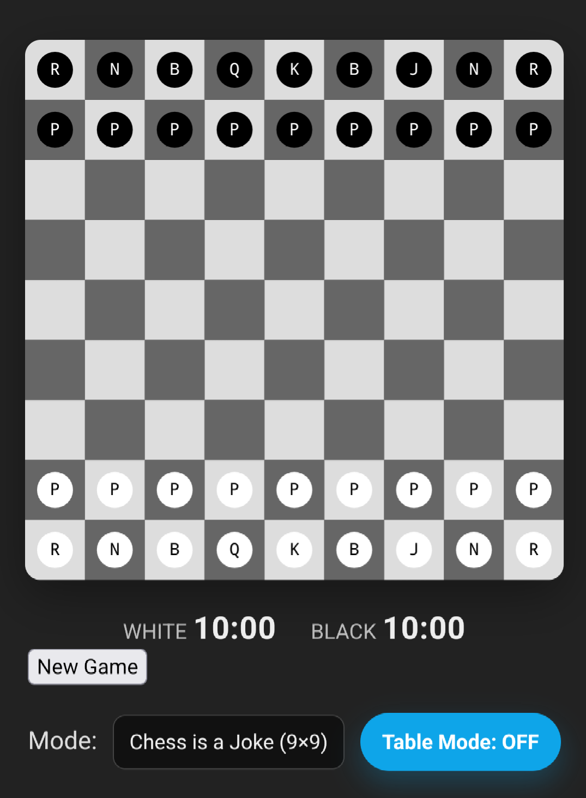

# Chess Is a Joke

> A 9×9 chess variant with a Joker that freezes instead of captures, a cheeky pawn move called *En Croissant*, and a wink at Alan Watts — chess is a game people play and call life.



Standard chess, then a few liberties: a wider board, an extra piece that disarms rather than destroys, and a pawn trick that puts opponents on ice. It runs in the browser with a small PHP backend, and you can play it at the table on a single device today.

## Contents

- [The variant](#the-variant)
- [Features](#features)
- [Tech stack](#tech-stack)
- [Getting started](#getting-started)
- [Project layout](#project-layout)
- [How a game flows](#how-a-game-flows)
- [Roadmap](#roadmap)
- [License](#license)
- [Credits](#credits)

## The variant

The board is **9 files × 9 ranks**, and each side gets the usual army plus one **Joker**.

- **The Joker** can't capture. It moves like a knight, and whenever it lands next to enemy pieces it **freezes** the highest-value one (ties freeze together). Frozen pieces can't move and stop exerting control, so a king can even walk past a frozen attacker. Move the Joker away and the freeze lingers one more turn; take the Joker and everything it held thaws at once.
- **En Croissant** is a freeze-based cousin of en passant. When a pawn tries to sneak alongside an enemy pawn that also double-stepped, the other side may step diagonally behind it — no capture, the passer is just frozen for a turn.
- **Promotion** can produce a Joker, castling is adjusted for the wider board, and check/checkmate ignore anything that's currently frozen.

The full rules live in [`about.html`](about.html), published as a defensive publication.

## Features

- Two modes from the same engine: **Chess Is a Joke (9×9)** and **Classic (8×8)**.
- A top-down WebGL board (Three.js) with animated moves — knights and the Joker hop, sliders accelerate in and wobble on landing — plus captures and a checkmate celebration. If WebGL isn't available it falls back to a plain 2D canvas automatically.
- **Move preview with confirm**: pick a piece, the legal squares light up, and the piece animates into place so you can see the position before you commit. Illegal targets are checked against the engine up front and just flash red — no wasted confirm.
- Table mode flips the board for across-the-table play, with clocks, a promotion menu, and frozen-square indicators.
- The PHP engine is the single source of truth. The client never decides legality.

## Tech stack

- **Backend:** PHP (no framework), per-game state stored as JSON files.
- **Frontend:** vanilla JavaScript (ES modules), [Three.js](https://threejs.org/) r160 (vendored locally), HTML/CSS.
- **Build step:** none.

## Getting started

You need **PHP 7.4 or newer**. From the repository root:

```bash
php -S 127.0.0.1:8000 -t .
```

Then open:

- `http://127.0.0.1:8000/` — the landing page
- `http://127.0.0.1:8000/play/` — jump straight into a game

Any host works as long as it runs PHP and serves `.js` with the `application/javascript` MIME type (needed for ES modules and the import map). The `engine/storage/` directory must be writable.

## Project layout

```
.
├── index.html          # landing page
├── about.html          # variant rules
├── play/               # the game UI
├── css/style.css
├── js/
│   ├── client.js       # controller (game logic, input, clocks)
│   ├── render2d.js     # 2D canvas renderer (fallback)
│   ├── renderGL.js     # top-down WebGL renderer (Three.js)
│   └── vendor/three/   # vendored Three.js
├── engine/
│   ├── Engine.php / Rules.php                 # joke mode (9×9)
│   ├── EngineClassic.php / RulesClassic.php   # classic (8×8)
│   ├── Position.php, Move.php, Storage.php, bootstrap.php
│   ├── new_game.php, validate_move.php, get_state.php, legal_moves.php, end_game.php
│   └── storage/        # per-game JSON state (runtime)
├── favicon.png
└── board-hero.png
```

`bootstrap.php` picks the joke or classic classes at runtime, so both variants share one set of endpoints.

## How a game flows

1. `new_game.php` mints a game id and writes the starting position.
2. The client polls `get_state.php` for the board, whose turn it is, frozen squares, and check status.
3. Selecting a piece asks `legal_moves.php` for that piece's legal targets (this drives the highlights and the red flash on illegal squares).
4. Confirming a move sends it to `validate_move.php`, which applies it through the engine and saves the result.
5. `end_game.php` records the outcome (checkmate, stalemate, draw, or timeout).

Today everything runs on one device for table play. Online play is next.

## Roadmap

- [ ] Online play backed by a database, replacing file-based storage, with real-time sync.
- [ ] Authored GLTF piece models — the current pieces are procedural placeholders, with the swap points already marked in the code.
- [ ] Accounts and match history.

## License

- **Variant rules / spec** (`about.html`): dedicated to the public domain via [CC0](https://creativecommons.org/publicdomain/zero/1.0/) as a defensive publication.
- **Code:** no license. It's public so you can read it and learn from it, but it isn't licensed for reuse — please don't use it commercially. All rights reserved.

## Credits

- Built with [Three.js](https://threejs.org/).
- The name nods to Alan Watts on the game people play and call life.
- Created by **oliverwestbrook** ([WildWestbrooks.com](https://www.wildwestbrooks.com)).
